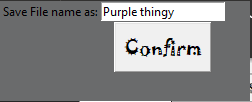
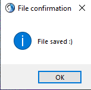

**The Only Necessary Yeeter** Documentation:

**Before running application:**

Check if you have all the necessary modules already installed on your computer (modules shown in code in the first few lines).

The ones that are not already in-built for Python are pyautogui and Pillow.

To install, in your command prompt, run:

- pip install PyAutoGui
- pip install Pillow

Make sure your display scaling is set to 100%. To check, open display settings and under scale and layout, check the percentage under “Change the size of text, apps, and other items”.

**Starting:**

Once you open application by running the python file in spyder.

This window should appear:

**Die! Button:**

The first button ‘Die!’ is a useless button left in the program as a joke/easter egg but not really. Once clicked all it does is print the following in your spyder console.	

**Importing Images:**

To begin using the program, click the ‘Import Image’ button which will open a file dialog window for you to choose the image file you want to edit:

Click any image you want to use and then click the ‘Open’ button on the bottom right of the window, alternatively you can also just double click on the image you want to use.

Once image has been imported into application, it will be displayed to the right of the buttons of the window	.

**Editing:**

To begin editing the image, click on the ‘Select Colour’ button which will enable your **right click** to select a colour from the image. Once you right click on the colour from the image you want to remove, it will be shown in the square box below the Tolerance Level entry slot for you to confirm the colour you selected is the one you want to edit.

Now there are 2 editing functionalities in the program, replacing the selected colour with another or removing the selected colour from the image and making it become a transparent background.

**Replace Colour Button:**

To use the replacing selected colour functionality, click on the ‘Replace Colour’ button and a colour selection gui should show up:

Once you have selected a colour from this window and clicked ‘ok’ on the bottom left of window, it should automatically replace the colour you selected in the image with the one you selected in the colour selection window. 

**Tolerance Level box:**

As seen in the picture, not all the black was replaced as it had a slightly different shade to the one you initially selected. In order to fix this, input a number into the Tolerance Level box which will determine the range of colour, similar to the colour you initially selected, that will also be included to be replaced. This allows to you fine tune the amount of a colour you want replaced in your image.

**Remove Colour Button:**

For the other editing functionality, click the ‘Remove Colour’ button. The colour you selected will automatically be removed from the image:

**Tolerance Level Box:**

Once again, not all the white for this image was removed due to different shadings. Enter a number in the Tolerance Level box to adjust the range of similar colours to the one you initially selected to be removed.

**Saving your image:**

In order to save your image, click the ‘Save File’ button. A window will pop up for you to enter what you want your image file name to be called:

Another window will then open up which will be the file navigation pane for you to choose where you want to save your file:

After you click ‘Select Folder’ on the bottom right of the window, if the file was saved, a pop-up message will inform you so:

There you go, that’s everything you need to know to use this program, you can then go back and import another image to edit to your heart’s desire. (:

- Tony Nguyen

